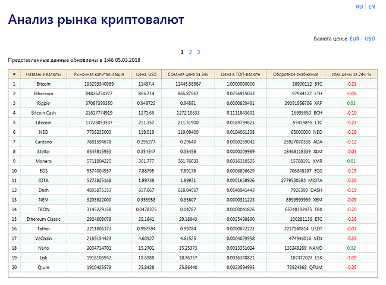

CoinMarket API Test
===================
This is a test app of coin market's history collecting through a Public API.

It consist of an Update daemon and a lightweight Web application to view collected data (no Rails, no ORM, hardcore SQL).

Includes I18n support and the ability to edit coin's Price and Circulating Supply values.





1. Clone the project and install gems
    ```
    git clone https://github.com/DMoN-dt/CoinMarketApiTest

    cd CoinMarketApiTest

    bundle install
    ```
2. Specify correct database, username, password at `config/database.yml`

3. Main settings are specified at `config/settings.yml`

    The USD price is saved always, also you can specify in the settings one more currency to save.

4. How to run:

    a) Execute `run_all.sh` to run in console.

    b) Execute `foreman_rbenv_start.sh` to run through [Foreman](https://theforeman.org) and [rbenv](https://github.com/rbenv/rbenv).
	
	c) Execute `docker-compose up` to run through [Docker](https://www.docker.com).

PS. Tested on Ruby 2.4.1 and PostgreSQL 9.5 / 10.4
